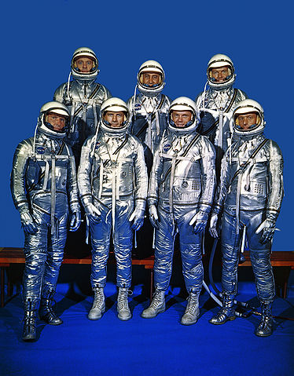

<a name="readme-top"></a>

<!-- PROJECT SHIELDS -->
[![Contributors][contributors-shield]][contributors-url]
[![Forks][forks-shield]][forks-url]
[![Stargazers][stars-shield]][stars-url]
[![Issues][issues-shield]][issues-url]
[![MIT License][license-shield]][license-url]
[![LinkedIn][linkedin-shield]][linkedin-url]


<!-- PROJECT LOGO -->
<br />
<div align="center">
  <a href="https://github.com/sunyam-lexicon-2024/lms">
    
  </a>
</div>

<h3 align="center"> Silver Astronauts </h3>
<h1 align="center"> LMS Application</h1>

<!-- TABLE OF CONTENTS -->
<details>
  <summary>Table of Contents</summary>
  <ol>
    <li>
      <a href="#about-the-project">About The Project</a>
      <ul>
        <li><a href="#project-status">Project Status</a></li>
        <li><a href="#contributors">Contributors</a></li>
        <li><a href="#assignment-document">Assignment Document</a></li>
        <li><a href="#built-with">Built With</a></li>
      </ul>
    </li>
    <li>
      <a href="#getting-started">Getting Started</a>
      <ul>
        <li><a href="#prerequisites">Prerequisites</a></li>
        <li><a href="#installation">Installation</a></li>
      </ul>
    </li>
    <li><a href="#usage">Usage</a></li>
    <li><a href="#contributing">Contributing</a></li>
    <li><a href="#license">License</a></li>
    <li><a href="#contact">Contact</a></li>
    <li><a href="#acknowledgments">Acknowledgments</a></li>
  </ol>
</details>


<!-- ABOUT THE PROJECT -->
## About The Project

A small application that enables the registration of students and teachers, as well as the management of courses and their related modules
and acitivites.

The goal of the assignment is to create a blazor based frontend that consumes a external API; allowing for the students to work with and learn about
the core functionalities and aspects that governs Blazor application development and use.


### Project Status

[](https://github.com/Sunyam-Lexicon-2024/lms/actions/workflows/build_test.yml)
[](https://app.fossa.com/projects/custom%2B45338%2Fgithub.com%2FSunyam-Lexicon-2024%2Flms?ref=badge_shield&issueType=license)


### Contributors

*Meet the awesome team!*

**[@Brucette](https://github.com/brucette)**

**[@Hellomynameislinda](https://github.com/hellomynameislinda)**

**[@MarekLuk](https://github.com/MarekLuk)**

**[@Rezapp](https://github.com/rezapps)**

**[@Suny-am](https://github.com/suny-am)**


### Assignment Document

[Assignment 17 PDF](.docs/pdf/assignment-document-17-final-project.pdf)


### Built With

[![.NET][.NET]][.NET-url]
[![Blazor][Blazor]][Blazor-url]
[![Podman][Podman]][Podman-url]
[![Docker][Docker]][Docker-url]

<p align="right"><a href="#readme-top">🔝</a></p>


<!-- GETTING STARTED -->
## Getting Started

The below sections go through how to start using this template

### Prerequisites

A containerized development environment inherently necessitates either using [Docker](https://www.docker.com) or [Podman](https://podman.io).
Please consult the corresponding solutions documentation([docker](https://docs.docker.com), [podman](https://podman.io/docs)) for the installation process of each.

##### example of installing Docker/Podman via brew 
```sh
brew install docker
brew install podman
```

### Installation

Once either docker or podman is available on the host the project is ready for use. Simply clone the repo and you are ready to start development!

   ```sh
   git clone https://github.com/sunyam-lexicon-2024/lms.git
   ```


<p align="right"><a href="#readme-top">🔝</a></p>


## Usage

Below are some options on how to run the template containers.
Do note that while docker is generally interchangable with podman, docker-compose and podman-compose are more opinionated and only docker-compose 
has been tested with this template setup.

#### Dockerfile
   ```sh
   # Podman is interchangable with Docker
   docker build -t lms-app .
   docker run lms-app -d
   docker exec -it -w workspace lms-app zsh
   ```
#### Docker Compose
   ```sh
   docker-compose up -d
   docker exec -it -w workspace lms-app zsh
   ```
#### VS Code Dev Containers extension
Simply enter select the `Dev Containers: Open Folder in Container...` option in the command palette and select the directory where the .devcontainer file resides. 

<!-- CONTRIBUTING -->
## Contributing

Contributions are what make the open source community such an amazing place to learn, inspire, and create. Any contributions you make are **greatly appreciated**.

If you have a suggestion that would make this better, please fork the repo and create a pull request. You can also simply open an issue with the tag "enhancement".
Don't forget to give the project a star! Thanks again!

#### 1. Fork the Project
```sh
gh repo fork sunyam-lexicon-2024/lms --clone
cd lms
```
#### 2. Create your Feature Branch 
```sh
git checkout -b feature/aNewCoolFeature
```
#### 3. Commit your Changes 
```sh
`git commit -m 'Add a new cool feature'
```
#### 4. Push to the Branch 
```sh
git push origin feature/aNewCoolFeature
```
#### 5. Open a Pull Request
```sh
gh pr create 
```

<p align="right"><a href="#readme-top">🔝</a></p>


<!-- USAGE EXAMPLES -->
## Usage

Use this space to show useful examples of how a project can be used. Additional screenshots, code examples and demos work well in this space. You may also link to more resources.

_For more examples, please refer to the [Documentation](https://example.com)_

<p align="right"><a href="#readme-top">🔝</a></p>


<!-- ROADMAP -->
## Roadmap

- [ ] Blazor Interactive Server Web Client
  - [x] ASP.NET Core Identity integration
  - [ ] Custom Theming
  - [x] Student dashboard
    - [ ] Course info
    - [x] Course Modules info
    - [ ] Course module activites info
  - [ ] Teacher dashbord
    - [ ] WIP 
- [ ] FastEndpoints API
  - [ ] Student Endpoints
    - [x] Get All Students
  - [ ] Teacher Endpoints
  - [ ] Course Endpoints
    - [x] Get Course Modules
    - [ ] WIP 
- [x] Data Modeling
  - [x] Entity Framework SQLite connection
  - [x] Entity Classes
  - [x] ASP.NET Core Identity integration
  - [x] Entity Configurations 
  - [x] Data seeds
  - [ ] WIP 

See the [open issues](https://github.com/sunyam-lexicon-2024/lms/issues) for a full list of proposed features (and known issues).

<p align="right"><a href="#readme-top">🔝</a></p>


<!-- CONTRIBUTING -->
## Contributing

Contributions are what make the open source community such an amazing place to learn, inspire, and create. Any contributions you make are **greatly appreciated**.

If you have a suggestion that would make this better, please fork the repo and create a pull request. You can also simply open an issue with the tag "enhancement".
Don't forget to give the project a star! Thanks again!

#### 1. Fork the Project
```sh
gh repo fork sunyam-lexicon-2024/lms --clone
cd dotnet-container-dev-env-starter
```
#### 2. Create your Feature Branch 
```sh
git checkout -b feature/aNewCoolFeature
```
#### 3. Commit your Changes 
```sh
`git commit -m 'Add a new cool feature'
```
#### 4. Push to the Branch 
```sh
git push origin feature/aNewCoolFeature
```
#### 5. Open a Pull Request
```sh
gh pr create 
```

<p align="right"><a href="#readme-top">🔝</a></p>


<!-- LICENSE -->
## License

Distributed under the MIT License. See [LICENCE.txt](LICENCE.txt) for more information.

<p align="right"><a href="#readme-top">🔝</a></p>


<!-- CONTACT -->
## Contact

Your Name - [@bsky.sunyam.social](https://bsky.app/profile/bsky.sunyam.social) - visualarea.1@gmail.com

Project Link: [https://github.com/sunyam-lexicon-2024/lms](https://github.com/sunyam-lexicon-2024/lms)

<p align="right"><a href="#readme-top">🔝</a></p>


<!-- MARKDOWN LINKS & IMAGES -->
<!-- https://www.markdownguide.org/basic-syntax/#reference-style-links -->
[contributors-shield]: https://img.shields.io/github/contributors/sunyam-lexicon-2024/lms.svg?style=for-the-badge
[contributors-url]: https://github.com/sunyam-lexicon-2024/lms/graphs/contributors
[forks-shield]: https://img.shields.io/github/forks/sunyam-lexicon-2024/lms?style=for-the-badge
[forks-url]: https://github.com/sunyam-lexicon-2024/lms/network/members
[stars-shield]: https://img.shields.io/github/stars/sunyam-lexicon-2024/lms.svg?style=for-the-badge
[stars-url]: https://github.com/sunyam-lexicon-2024/lms/stargazers
[issues-shield]: https://img.shields.io/github/issues/sunyam-lexicon-2024/lms.svg?style=for-the-badge
[issues-url]: https://github.com/sunyam-lexicon-2024/lms/issues
[license-shield]: https://img.shields.io/github/license/sunyam-lexicon-2024/lms.svg?style=for-the-badge
[license-url]: https://github.com/sunyam-lexicon-2024/lms/blob/master/LICENSE.txt
[linkedin-shield]: https://img.shields.io/badge/-LinkedIn-black.svg?style=for-the-badge&logo=linkedin&colorB=555
[linkedin-url]: https://linkedin.com/in/carl-sandberg-01070a2b6/
[product-screenshot]: .docs/images/screenshot.png
[Docker]: https://img.shields.io/badge/docker-2496ED?style=for-the-badge&logo=docker&logoColor=white
[Docker-url]:https://docker.com
[Podman]: https://img.shields.io/badge/podman-000000?style=for-the-badge&logo=podman&logoColor=white&logoSize=large&color=892CA0
[Podman-url]:https://podman.io
[.NET]: https://img.shields.io/badge/.NET-5C2D91?style=for-the-badge&logo=.net&logoColor=white
[.NET-url]: https://dotnet.microsoft.com/
[Blazor]: https://img.shields.io/badge/blazor-512BD4?style=for-the-badge&logo=blazor
[Blazor-url]:https://dotnet.microsoft.com/en-us/apps/aspnet/web-apps/blazor
